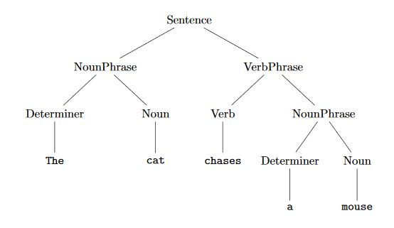

# Natural-Language-Processing-with-Deep-Learning

> NLP deals with the use of human languages by a computer. [GBC16, p. 461] It has many different applications, which all refer to humans’ unstructured natural language. For example, its application areas are machine translation, speech recognition,dialog systems, named entity recognition, information retrieval and text classification.Thus, the domain of NLP encompasses all interactions between a computer and a human,by the use of written or spoken natural language.

The difficulties of NLP consist of all components of natural language, such as 

* Phonology:
This  is  the  study  of  how  speech  sounds  function  and  are  organised  in  a  particular  natural language.phonetics analyses the physical production of speech, independent of language.

* Morphology:
The  smallest  meaningful  unit  in  the  grammar  of  a  language  is  called  a morpheme.This level then performs morphological decomposition of words into roots and affixes to infer their internal structure.

* Syntax:
This  level  infers  the  grammatical  structure  of  the  sentence,  that  is  the  structural  dependencies among the constituent words. It includes the tagging of the words with Part-of-Speech (POS) categories,for  example noun,verb and preposition.
The word-POS tag sequences grouped with constituent parsing into phrases such as noun phrases (headed by a noun),verb phrases(headed by averb) and prepositional phrases (headed by a preposition).

 

* Semantics:
This  is  the  study  of  meaning  of  linguistic  expressions.    More  narrowly  defined, it  is  the  study  of  word  sense  on  the  sentence  level,  not  yet  considering  discourse  and  pragmaticfactors  (explanations  to  follow) .At  this  level,  the  meaning  of  the remaining ambiguous words from the lexical stage are resolved by considering the interactions among the individual word senses in the sentence which called word-sense disambiguation. 

* Discourse
This  level  of  analysis functions on the whole document or discourse, connecting meaning (for example POS, number agreement,gender, et cetera) across sentences. Coreference resolutionis a technique that automatically tracks all the mentions of a particular discourse entity in a discourse and stores them in an indexed coreference chain(like below).
 
         Michael is a boy.  He likes the girl.  She is pretty.
         
         two coreference chains are formed:{Michael,a boy,He} 
         
* Pragmatics:
This is the study of meaning in context over and above that which can be captured by the text, for example the intent, plan and/or goal of the speaker, the status of the parties involved and other world knowledge. Pragmatics is in this way an explanation of how humans are able to overcomethe inherent ambiguity in natural language sentences.

* Lexicology:
Lexical analysis determines the underlying meaning or sense of individual words, typically bylookup in a dictionary called a lexicon.

#### As you can see all of these components must be taken into account in order to gain complete understanding of amessage.
