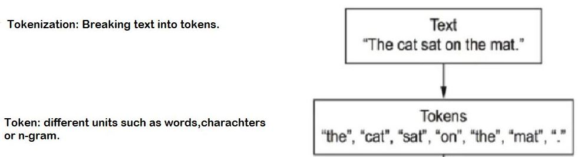
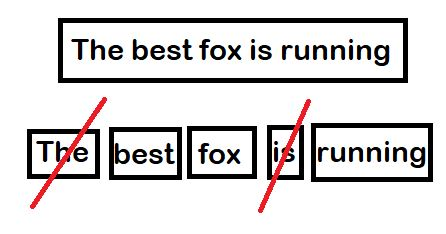

# Natural-Language-Processing-with-Deep-Learning

 Your Text NLP deals with the use of human languages by a computer. [GBC16, p. 461] It has many different applications, which all refer to humans’ unstructured natural language. For example, its application areas are machine translation, speech recognition,dialog systems, named entity recognition, information retrieval and text classification.Thus, the domain of NLP encompasses all interactions between a computer and a human,by the use of written or spoken natural language.

The difficulties of NLP consist of all components of natural language, such as 

* Phonology:
This  is  the  study  of  how  speech  sounds  function  and  are  organised  in  a  particular  natural language.phonetics analyses the physical production of speech, independent of language.

* Morphology:
The  smallest  meaningful  unit  in  the  grammar  of  a  language  is  called  a morpheme.This level then performs morphological decomposition of words into roots and affixes to infer their internal structure.

* Syntax:
This  level  infers  the  grammatical  structure  of  the  sentence,  that  is  the  structural  dependencies among the constituent words. It includes the tagging of the words with Part-of-Speech (POS) categories,for  example noun,verb and preposition.
The word-POS tag sequences grouped with constituent parsing into phrases such as noun phrases (headed by a noun),verb phrases(headed by averb) and prepositional phrases (headed by a preposition).

 

* Semantics:
This  is  the  study  of  meaning  of  linguistic  expressions.    More  narrowly  defined, it  is  the  study  of  word  sense  on  the  sentence  level,  not  yet  considering  discourse  and  pragmaticfactors  (explanations  to  follow) .At  this  level,  the  meaning  of  the remaining ambiguous words from the lexical stage are resolved by considering the interactions among the individual word senses in the sentence which called word-sense disambiguation. 

* Discourse
This  level  of  analysis functions on the whole document or discourse, connecting meaning (for example POS, number agreement,gender, et cetera) across sentences. Coreference resolutionis a technique that automatically tracks all the mentions of a particular discourse entity in a discourse and stores them in an indexed coreference chain(like below).
 
         Michael is a boy.  He likes the girl.  She is pretty.
         
         two coreference chains are formed:{Michael,a boy,He} 
         
* Pragmatics:
This is the study of meaning in context over and above that which can be captured by the text, for example the intent, plan and/or goal of the speaker, the status of the parties involved and other world knowledge. Pragmatics is in this way an explanation of how humans are able to overcomethe inherent ambiguity in natural language sentences.

* Lexicology:
Lexical analysis determines the underlying meaning or sense of individual words, typically bylookup in a dictionary called a lexicon.

#### As you can see all of these components(domain knowledge, discourse knowledge,word knowledge) must be taken into account in order to gain complete understanding of a message.

Deep Learning for natural language porocessning is pattern recognition applied to words, sentences and paragraphs in much the same way that computer vision is pattern recognition applied to pixels. 

#### Applications of NLP:

* Document classification such as identifying the topic of an article ot the author of a book.
* Sequence-to-sequence learning such as machine translation 
* Sentiment analysis
* Image Captioning

 
 
* Visual question answering
 

 
 
 [question answering example](https://books.google.com/talktobooks/)
 
#### Text Preprocessing in NLP:
Feature selection and preprocessing are significant tasks in Deep Learning also in NLP, this task does have tremendous impact on the success of text analysis. This is mostly caused by the unstructured and arbitrary nature of text data.  Furthermore, machines need structure and numerical data. A couple of approaches for this transformation task,e.g. word embeddings or the vector space model, exist. This section’s scope lies on the theoretical foundation of different preprocessing and feature selection techniques.

#### Vectorization:

Deep learning model don't take as input raw text, they only work with numeric tensors thefor we need to tranform texts into numeric tensors which called Vectorization. Notice: Text can be defined as sequences of charachters or sequences of words(most common).

##### Vectorization way:
1. Segement text into word and transform each word into a vector

2. Segement text into characters and transform characters  into a vector

3. Extract n-grams of words or characters and transfor each n-gram into a vector.

* N-gram: overlapping groups of multiple consecutive words or charachters and extracting n-gram is a form of feature engineering and deep learning does away with this kind of girid,brittle approach.
 

 

 

* Bag of Word: you are dealing with a set of words rather than a list or sequence(In simple terms, it’s a collection of words to represent a sentence with word count and mostly disregarding the order in which they appear). it tends to be used in shallow language processing model rather than in deep learning.
 [Bag of Word Algorithm](https://www.freecodecamp.org/news/an-introduction-to-bag-of-words-and-how-to-code-it-in-python-for-nlp-282e87a9da04/)

 

 

 

#### Stop Word Removal 
A very important approach to reduce the huge raw input space in NLP is stop word removal(swr). Most languages have specific words, which do appear more often than others or donot include much information about the content of the text, e.g. auxiliary verbs or articles. Due to this, it often makes sense to exclude this so-called stop words in further analysis(after tokenization). In English such words could be "the", "a" or "an" and for German typical stopwords are the articles "der", "die" and "das". The elimination could be done by checkingthe words against a standardized stop word list.

 

 

 
 
#### Stemming
 
Besides stop word elimination, stemming is a useful technique to map words to their word stems and further reduce the input dimension. This helps to extract the real meaning of a text and makes the unstructured data better accessible for a machine.The porter stemming algorithm is a state-of-the-art approach and strips sufixes from words to retain the word stem. It performs well in English, there are some drawbacks for other languages.

 

 

 
 
#### Lemmatization
is the process of mapping every word in a text to their dictionary type or intended originating structure. Verbs are transformed to their infinite form, a noun is reconstructed to it’s singular representation and adverbs or adjectives anticipate their positive format. The method is based on morphological analysis and often usesa dictionary.
 

 

#### There are two ways that can transform a token into a vector

 

**1. One-hot Encoding:**
A one hot encoding is a representation of categorical variables as binary vectors. Each integer value is represented as a binary vector that is all zero values except the index of the integer, which is marked with a 1. 
Example implementation of One-hot encoding is shown below:[Code](https://github.com/A2Amir/Natural-Language-Processing-with-Deep-Learning/blob/master/One%20Hot%20Encoding%20(NLP).ipynb)

 
 * We only take into account the N msot common word in the dataset to avoisd dealing with verly large input vector spcae
 
 * It can be done at both word level and character level.
 
 * The shape of a one-hot encoded vectorization of a list of M documen, where we only consider the first K words of each sentence is (M,K,N).
 
 * The vectors obtained through one-hot encoding are binary, sparse (mostly made of zeros) and very high-dimensional (same dimensionality as the number of words in the vocabulary) which make this approach inefficient when the number of words in our vocabulary to much is.

**2. Distributed representations (word embeddings):**
 Another popular and powerful way to associate a vector with a token (word) is the use of dense "word vectors", also called "distributed representations". The distributed representations we build will always be vectors of real numbers. The models are often called vector space models (VSMs).If a neural network is used to train the representations, then they might be called neural representations. The term word embedding is also used for distributed representations, including distributional ones. This term is a reminder that vector representations are meaningful only when embedded in and compared with others in a unified space (usually a matrix) of representations of the same type.
 In other words, word embeddings are low-dimensional floating point vectors (i.e. "dense" vectors, as opposed to sparse vectors in one-hot encoding). Unlike word vectors obtained via one-hot encoding, word embeddings are learned from data. It is common to see word embeddings that are 256-dimensional, 512-dimensional, or 1024-dimensional when dealing with very large vocabularies.
As an important point, word embedding is able to model the similarity between words ([Model Similarity]()).

 
 **Differencies between Word Embeddding and One-hot Encoding**
 

 
 word embeddings pack more information into far fewer dimensions. 

There are two ways to obtain word embeddings:

* Learn word embeddings jointly with the main task you care about (e.g. document classification or sentiment prediction). 
In this setup, you would start with random word vectors, then learn your word vectors in the same way that you learn the weights of a neural network.
* Load into your model word embeddings that were pre-computed using a different machine learning task than the one you are trying to solve. These are called "pre-trained word embeddings". 

 
